# Transcribe audio

En este apartado crearemos el repositorio *S3* origen de ficheros de audio, el repositorio *S3* destino para las transcripciones y la lambda encargada de llamar a *AWS Transcribe* para trascribir el fichero de audio.

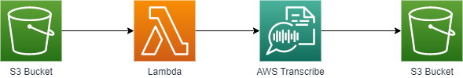

## Creación de los repositorios de origen y destino

En este apartado detallaremos cómo crear un repositorio básico de S3. Seguiremos los pasos dos veces para crear tanto el repositorio de origen de los ficheros de audio, cómo el de destino de las transcripciones.

El primer paso será ir a la página del servicio S3.

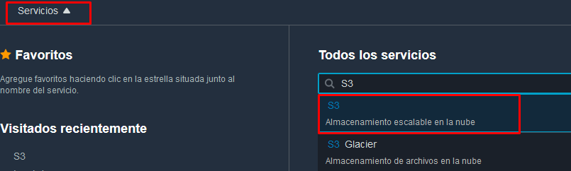

Una vez allí pulsaremos en el botón "Crear bucket". La configuración por defecto nos sirve por lo que sólo definiremos el nombre y la región, y pulsaremos en el botón de "Crear". Tened en cuenta que el nombre del bucket deber ser único para todo el mundo y que **la región debe ser la misma que la región dónde vamos a crear nuestras lambdas**. Aseguraros que la región escogida tiene disponibles todas las tecnologías que vamos a usar.

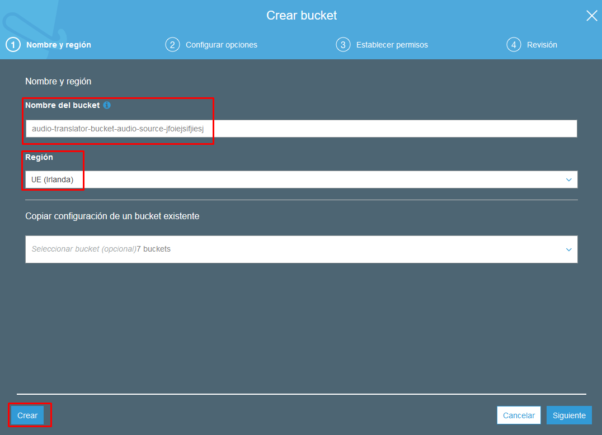

Con esto ya tenemos nuestro repositorio creado y podemos subir ficheros en él. Además, este repositorio por defecto es privado y a menos que nosotros demos permisos a los usuarios o aplicaciones, nadie podrá acceder a él.

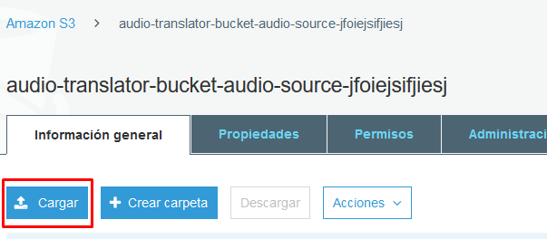

## Creación de la lambda

Antes de crear nuestra lambda deberemos crear un rol de ejecución para que AWS Transcribe pueda acceder a objetos de nuestros repositorios y escribir en ellos. Para hacerlo, vamos a acceder al servicio de IAM.

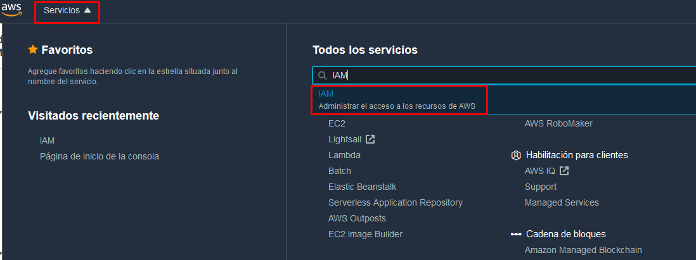

Iremos al apartado de roles y crearemos un nuevo rol.

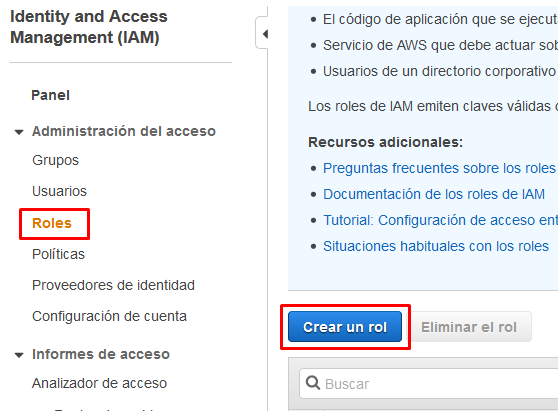

Al crear el rol nos va a pedir seleccionar qué entidades van a poder ejecutar nuestro role. En la lista no aparece *AWS Transcribe* por lo que escojeremos el caso de uso de una *Lambda*.

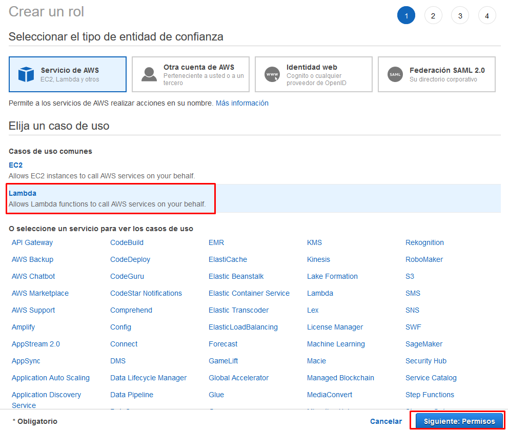

En el siguiente paso nos va a pedir asociar una política de permisos. Cómo no hay ninguna con nuestra configuración, vamos a crear una nueva política.

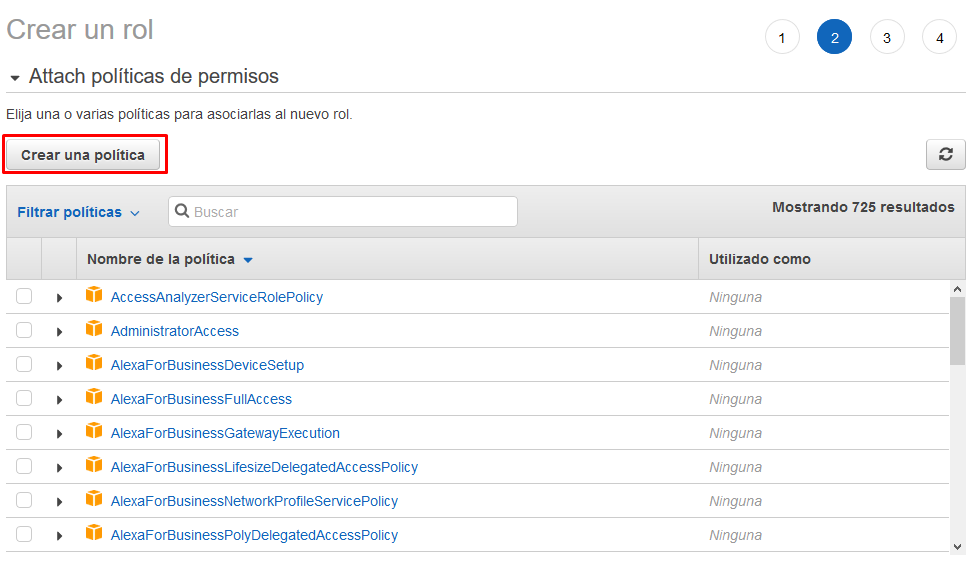

Al crear una nueva política nos abrirá una nueva pestaña del navegador. Las políticas pueden crearse tanto con un editor visual cómo definiendolas en formato JSON. En nuestro caso, vamos a definirla en formato JSON con la siguiente configuración:

```json
{
    "Version": "2012-10-17",
    "Statement": [
        {
            "Action": "s3:GetObject",
            "Resource": "arn:aws:s3:::*/*",
            "Effect": "Allow"
        },
        {
            "Action": "s3:PutObject",
            "Resource": "arn:aws:s3:::*/*",
            "Effect": "Allow"
        }
    ]
}
```

A continuacíon, pulsaremos en "Revisar política" y le daremos un nombre y una descripción.

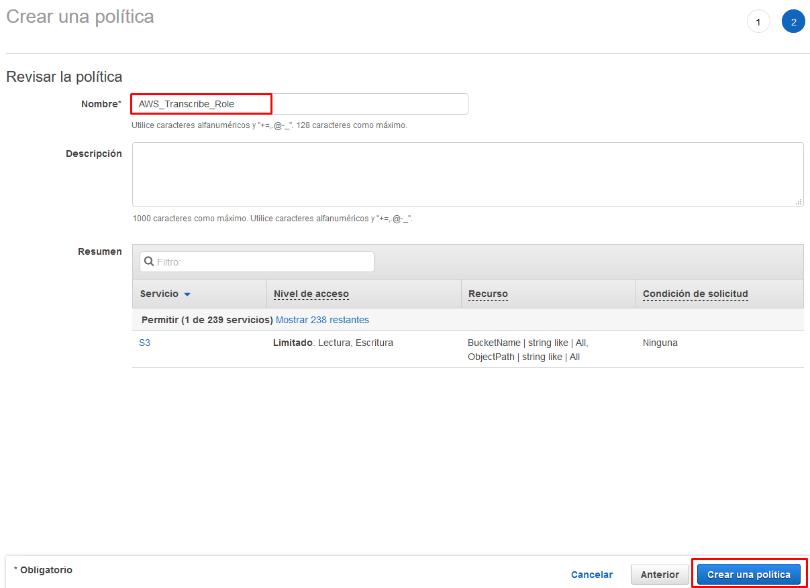

Una vez creada la política de permisos volveremos a la pestaña anterior y la asociaremos a nuestro rol. Si no aparece en el buscador, pulsad en el botón de refrescar.

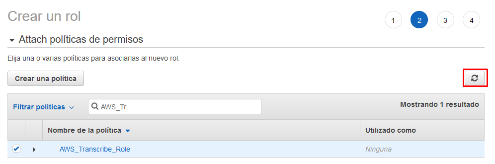

Pulsaremos en "Siguiente: Etiquetas", en "Siguiente: Revisar" (opcionalmente podemos añadir etiquetas a nuestra lambda) y, finalmente, llegaremos a la pantalla dónde nos pedira poner un nombre y descripción en nuestro rol. Damos un nombre y una descripción al rol y pulsamos el botón de "Crear un rol".

Una vez creado el rol, vamos a editarlo para permitir que se ejecute desde AWS Transcribe. Para hacerlo, vamos a buscar nuestro rol recién creado y clicaremos en él. En el resumen iremos a la pestaña de relaciones de confianza y la editaremos.

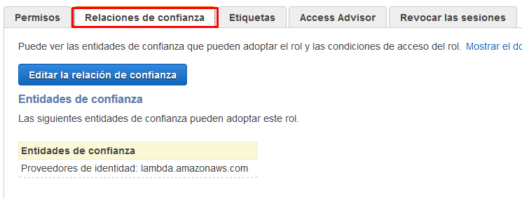

Al editarla cambiaremos el servicio asociado a *AWS Transcribe*.

```json
{
  "Version": "2012-10-17",
  "Statement": [
    {
      "Effect": "Allow",
      "Principal": {
        "Service": "transcribe.amazonaws.com"
      },
      "Action": "sts:AssumeRole"
    }
  ]
}
```

Ahora que ya tenemos nuestro rol creado ya podemos crear nuestra lambda.

Para hacerlo, iremos a la página del servicio *AWS Lambda* y pulsaremos el botón "Crear un función".

Al crear la función, seleccionaremos la opción "Crear desde cero", daremos nombre a nuestra función, seleccionaremos Node.js 12.x cómo lenguaje de ejecución y seleccionaremos la opción de "Creación de un nuevo rol con permisos básicos de Lambda".

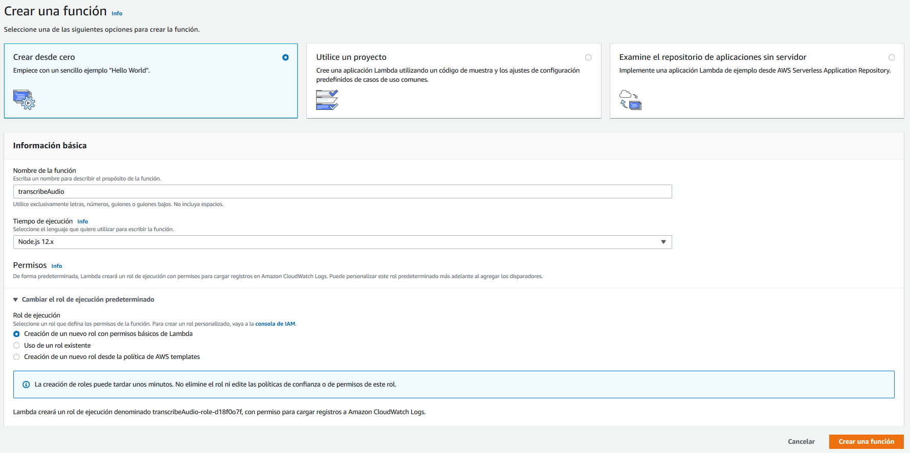

Una vez creada, eliminaremos el código de la función y lo reemplazaremos por el siguiente [código](./audio-translator-send-audio-to-transcribe.js) que se encargará de hacer la llamada a *AWS Transcribe*. Justo debajo del editor de código, hay una opción para editar las variables de entorno. Para que nuestra lambda funcione necesitaremos crear dos variables de entorno:

| Clave                       | Valor                                       |
| --------------------------- | ------------------------------------------- |
| OUTPUT_BUCKET_NAME          | \<nombre del repositorio destino de S3>     |
| TRANSCRIBE_DATA_ACCESS_ROLE | \<Arn del rol para ejecutar AWS Transcribe> |

Para todas las demás opciones de configuración, nos quedamos con las dadas por defecto.

A continuación, añadiremos un desencadenador para nuestra lambda.

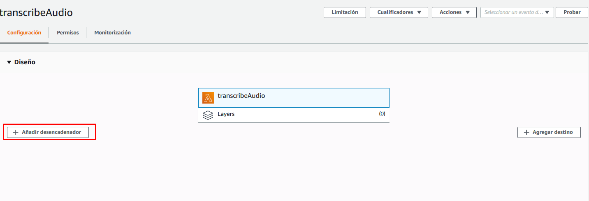

Seleccionaremos la opción de *S3*, nuestro repositorio origen y dejaremos seleccionado el tipo de evento "Todos los eventos de creación de objetos".

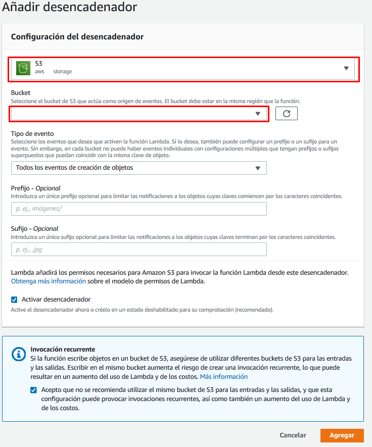

Por último nos queda acabar de configurar el rol de ejecución de la lambda para que permita la llamada a *AWS Transcribe*. Para hacerlo, iremos a la pestaña de permisos y editaremos el rol de ejecución que nos aparezca.

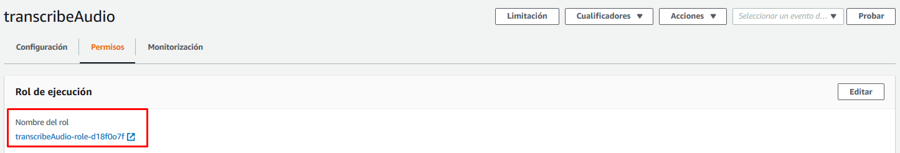

Una vez en el editor del rol vemos la política que se crea por defecto en las lambdas. En nuestro caso, queremos añadir una nueva política que permita la llamada a *AWS Transcribe* y el envío del rol de ejecución que usará *AWS Transcribe*. Para hacerlo, pulsaremos en el botón "Añadir una política insertada".

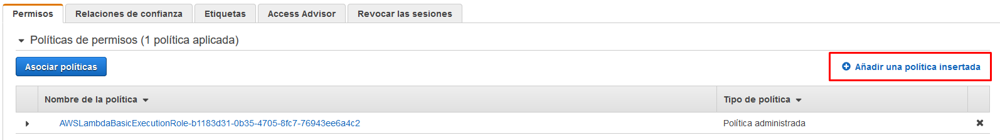

En la nueva política que estamos creando añadiremos los siguientes permisos en el editor JSON y le daremos un nombre:

```json
{
    "Statement": [
        {
            "Action": [
                "transcribe:*",
                "iam:PassRole"
            ],
            "Resource": "*",
            "Effect": "Allow"
        }
    ]
}
```

Ahora ya deberíamos poder ejecutar nuestra lambda sin problemas. Para hacer la prueba, subiremos un nuevo audio a nuestro repositorio origen y veremos que aparece la transcripción en el repositorio destino.

## Monitorización

Podéis validar que la lambda se está ejecutando cada vez que subáis un audio en el repositorio S3 revisando la pestaña de monitorización. Incluso podéis ver los logs de la ejecución pulsando en "Ver los registros de CloudWatch". Tened en cuenta que si la lambda no se ha llegado a ejecutar nunca, no se va a encontrar ningún log.

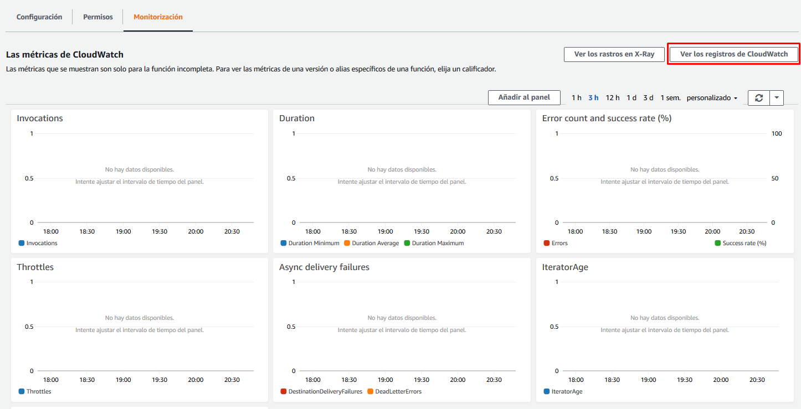


---

Capítulo siguiente: [Publicación de las transcripciones a SNS](./01-transcribe-audio-and-send-transcription-to-sns/send-transcription-to-sns/guide.md)


