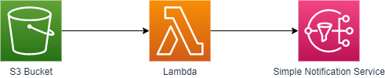
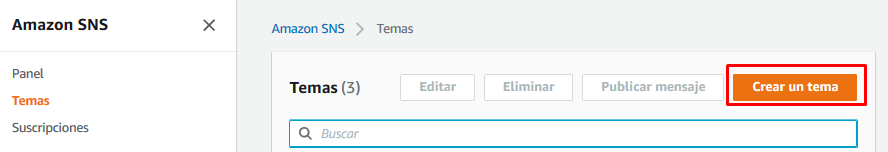
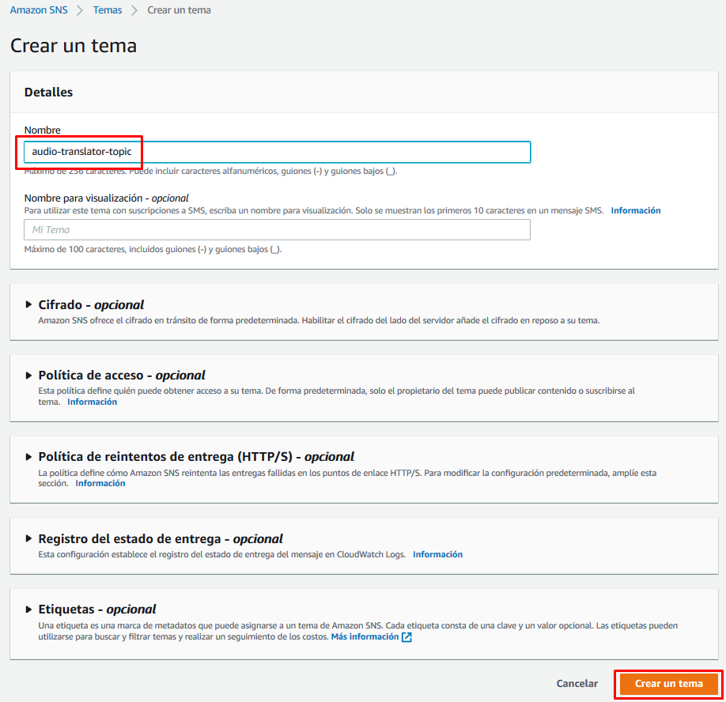
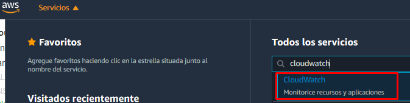
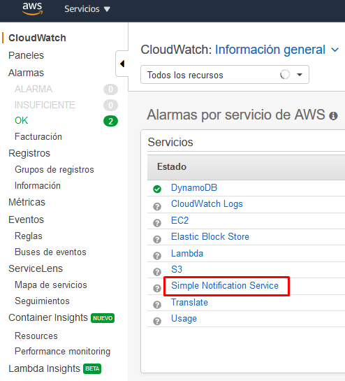
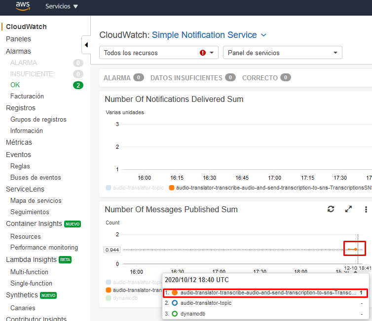

# Send transcription to SNS

En este apartado crearemos el *tema* de *SNS* dónde enviaremos las transcripciones y la lambda encargada de enviar dichas transcripciones cada vez que se crean en nuestro repositorio *S3*.




## Creación del tema de SNS

Para crear un tema de SNS, iremos al servicio de SNS y pulsaremos en el botón *"Crear un tema"*.



Una vez allí, daremos nombre a nuestro tema y dejaremos los valores por defecto:




## Creación de la lambda

Para hacerlo, iremos a la página del servicio *AWS Lambda* y pulsaremos el botón "Crear un función".

Igual que en el capítulo anterior, seleccionaremos la opción "Crear desde cero", daremos nombre a nuestra función, seleccionaremos Node.js 12.x cómo lenguaje de ejecución y seleccionaremos la opción de "Creación de un nuevo rol con permisos básicos de Lambda".


Una vez creada, eliminaremos el código de la función y lo reemplazaremos por el siguiente [código](./audio-translator-send-transcription-to-sns.js) que se encargará de obtener la transcripción del repositorio S3, obtener el texto completo de la transcripción y enviarlo al tema de SNS. Justo debajo del editor de código, hay una opción para editar las variables de entorno. Para que nuestra lambda funcione necesitaremos crear una variable de entorno:

| Clave            | Valor                  |
| ---------------- | ---------------------- |
| OUTPUT_SNS_TOPIC | \<Arn del tema de SNS> |

Para todas las demás opciones de configuración, nos quedamos con las dadas por defecto.

A continuación, añadiremos un desencadenador para nuestra lambda. Seleccionaremos la opción de *S3*, nuestro repositorio de transcripciones y dejaremos seleccionado el tipo de evento "Todos los eventos de creación de objetos".


Por último nos queda acabar de configurar el rol de ejecución de la lambda para que permita obtener objetos del repositorio S3 y enviar mensajes al topic de SNS. Para hacerlo, iremos a la pestaña de permisos y editaremos el rol de ejecución que nos aparezca.

Una vez en el editor del rol pulsaremos en el botón "Añadir una política insertada".


En la nueva política que estamos creando añadiremos los siguientes permisos en el editor JSON. Nótese que no estamos definiendo a qué recursos exactos podemos ejecutar dichas acciones para simplificar la guía.

```json
{
    "Version": "2012-10-17",
    "Statement": [
        {
            "Effect": "Allow",
            "Action": [
                "s3:GetObject",
                "sns:Publish"
            ],
            "Resource": "*"
        }
    ]
}
```

Ahora ya deberíamos poder ejecutar nuestra lambda sin problemas. Para hacer la prueba, subiremos un nuevo audio a nuestro repositorio de audios, veremos que aparece la transcripción en el repositorio de transcripciones y validaremos que el mensaje se ha enviado al tema de SNS.

## Consulta de mensajes en SNS

Para validar que realmente se han enviado mensajes en el tema de SNS, usaremos los registros de CloudWatch.



Una vez dentro, navegaremos al apartado de *Simple Notification Service*...



y validaremos que se han publicado mensajes en nuestro tema.




## Monitorización

Podéis validar que la lambda se está ejecutando cada vez que subáis un audio en el repositorio S3 revisando la pestaña de monitorización. Incluso podéis ver los logs de la ejecución pulsando en "Ver los registros de CloudWatch". Tened en cuenta que si la lambda no se ha llegado a ejecutar nunca, no se va a encontrar ningún log.


---

Capítulo anterior: [Transcripción de audio](../send-audio-to-transcribe/guide.md)

Capítulo siguiente: [Traducción de transcripciones consumidas de SNS](../../02-translate-transcription-from-sns/guide.md)

