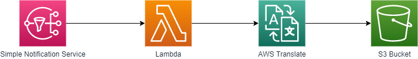
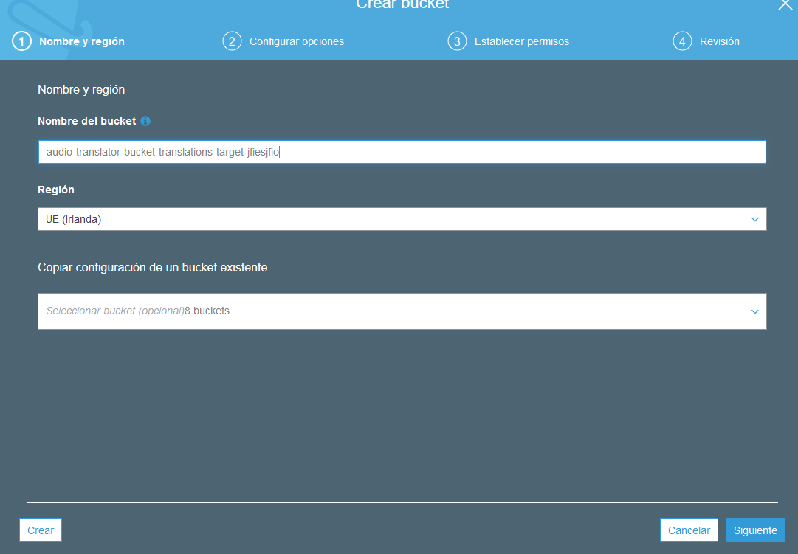
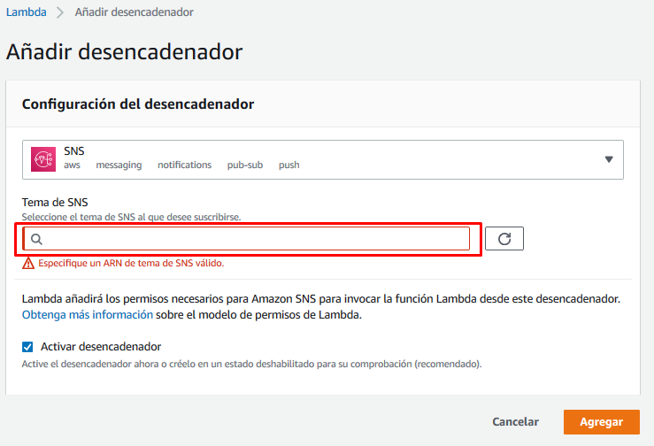
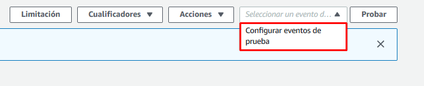
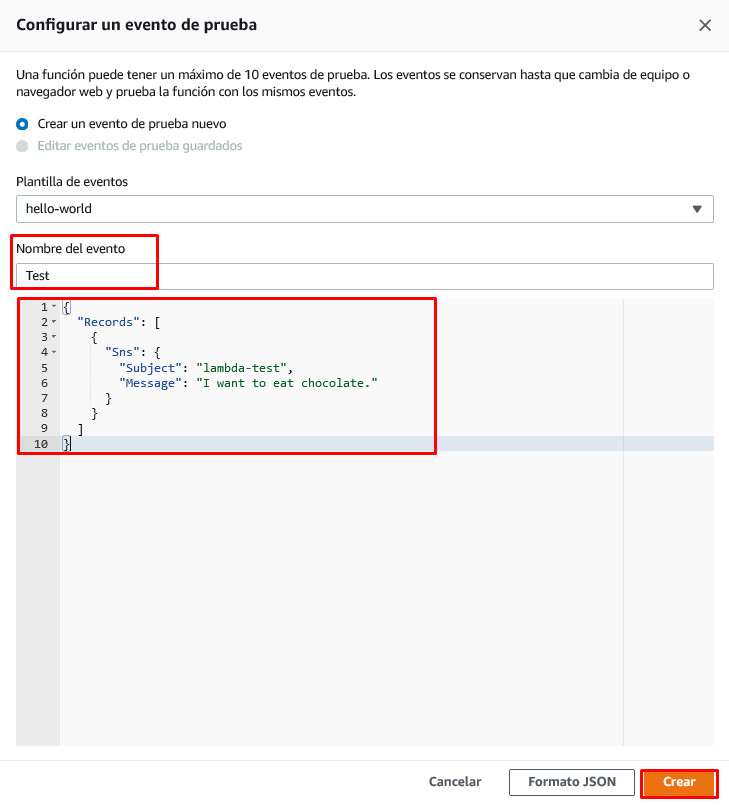
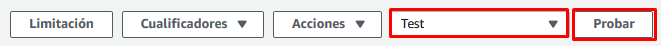
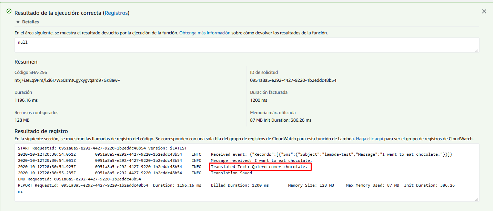

# Translate transcription from SNS

En este apartado crearemos el repositorio *S3* dónde guardaremos las traducciones y la *lambda* encargada de traducir dichas transcripciones mediante *AWS Translate*.



## Creación del repositorio S3

Iremos a la página del servicio S3 y una vez allí pulsaremos en el botón "Crear bucket". La configuración por defecto nos sirve por lo que sólo definiremos el nombre y la región, y pulsaremos en el botón de "Crear". Tened en cuenta que el nombre del bucket deber ser único para todo el mundo y que **la región debe ser la misma que la región dónde vamos a crear nuestras lambdas**. Aseguraros que la región escogida tiene disponibles todas las tecnologías que vamos a usar.



Con esto ya tenemos nuestro repositorio creado. Además, este repositorio por defecto es privado y a menos que nosotros demos permisos a los usuarios o aplicaciones, nadie podrá acceder a él.

## Creación de la lambda

Para hacerlo, iremos a la página del servicio *AWS Lambda* y pulsaremos el botón "Crear un función".

Al crear la función, seleccionaremos la opción "Crear desde cero", daremos nombre a nuestra función, seleccionaremos Node.js 12.x cómo lenguaje de ejecución y seleccionaremos la opción de "Creación de un nuevo rol con permisos básicos de Lambda".


Una vez creada, eliminaremos el código de la función y lo reemplazaremos por el siguiente [código](./audio-translator-translate-transcription-from-sns.js) que se encargará de hacer la llamada a *AWS Translate* y guardar el resultado en nuestro repositorio destino. Justo debajo del editor de código, hay una opción para editar las variables de entorno. Para que nuestra lambda funcione necesitaremos crear una variable de entorno:

| Clave              | Valor                                   |
| ------------------ | --------------------------------------- |
| OUTPUT_BUCKET_NAME | \<nombre del repositorio destino de S3> |

Para todas las demás opciones de configuración, nos quedamos con las dadas por defecto.

A continuación, añadiremos un desencadenador para nuestra lambda. Seleccionaremos la opción de *SNS* y el tema que hemos creado en el capítulo anterior.



Por último nos queda acabar de configurar el rol de ejecución de la lambda para que permita la llamada a *AWS Translate* y la escritura en el repositorio *S3* destino. Para hacerlo, iremos a la pestaña de permisos y editaremos el rol de ejecución que nos aparezca.

Una vez en el editor del rol pulsaremos en el botón "Añadir una política insertada".


En la nueva política que estamos creando añadiremos los siguientes permisos en el editor JSON y le daremos un nombre:

```json
{
    "Statement": [
        {
            "Action": [
                "translate:TranslateText",
                "s3:PutObject"
            ],
            "Resource": "*",
            "Effect": "Allow"
        }
    ]
}
```

Ahora ya deberíamos poder ejecutar nuestra lambda sin problemas. Para hacer la prueba, crearemos un test simulando una recepción de un mensaje del topic de SNS y validaremos que la traducción se ha generado correctamente en nuestro repositorio destino.

## Configuración y ejecución de eventos de prueba

Para configurar un evento de prueba iremos al desplegable al lado del botón *Probar* y pulsaremos en *Configurar eventos de prueba*.


Una vez allí crearemos un evento de prueba con el siguiente JSON:

```json
{
  "Records": [
    {
      "Sns": {
        "Subject": "lambda-test",
        "Message": "I want to eat chocolate."
      }
    }
  ]
}
```


y lo ejecutaremos.



Si todo ha ido correctamente veremos el siguiente mensaje:



También podréis observar que se ha creado un nuevo fichero en vuestro repositorio S3 con el nombre *lambda-test-ES.txt* y contenido *"Quiero comer chocolate."*

## Monitorización

Podéis validar que la lambda se está ejecutando cada vez que subáis un audio en el repositorio S3 inicial revisando la pestaña de monitorización. Incluso podéis ver los logs de la ejecución pulsando en "Ver los registros de CloudWatch". Tened en cuenta que si la lambda no se ha llegado a ejecutar nunca, no se va a encontrar ningún log.


---

Capítulo anterior: [Publicación de las transcripciones a SNS](../01-transcribe-audio-and-send-transcription-to-sns/send-transcription-to-sns/guide.md)

Capítulo siguiente: [Guardado de las transcripciones consumidas de SNS](../03-store-transcription-from-sns/guide.md)