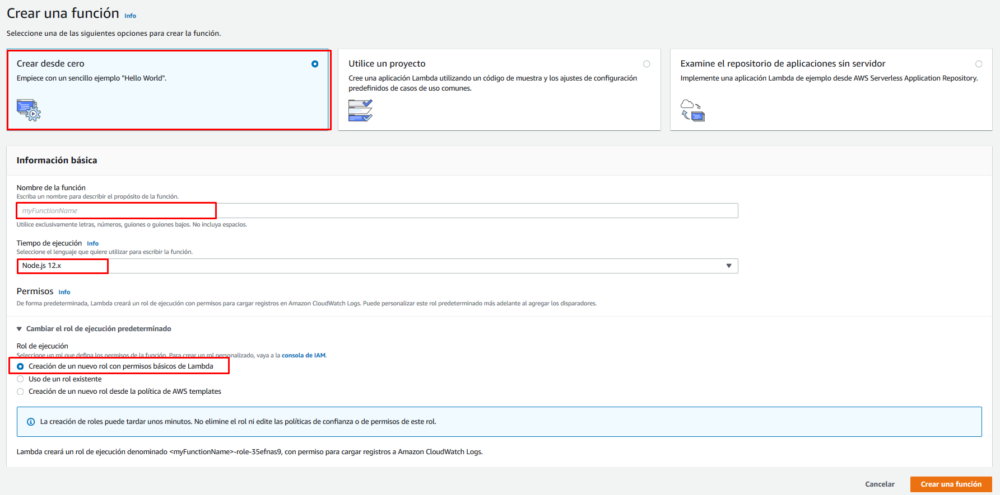
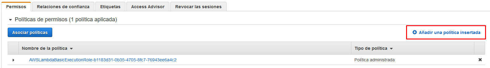
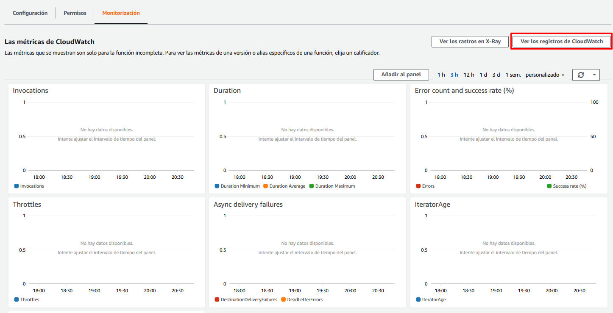

# Store transcription from SNS

En este apartado crearemos la base de datos de tipo *DynamoDB* dónde guardaremos las transcripciones y la *lambda* encargada de guardar las transcripciones recibidas a través del *topic* de *SNS*.


## Creación de una tabla de DynamoDB

Iremos a la página del servicio DynamoDB y una vez allí pulsaremos en el botón "Crear tabla".


Una vez allí, crearemos una tabla con el nombre que querramos darle. A la clave principal le daremos el nombre *"MessageTitle"* y le pondremos el tipo *"Cadena"* (String) para que encaje con el código de la lambda proporcionado a continuación. 


Con esto ya tenemos nuestro tabla creada para ir guardando las transcripciones.

## Creación de la lambda

Para hacerlo, iremos a la página del servicio *AWS Lambda* y pulsaremos el botón "Crear un función".

Al crear la función, seleccionaremos la opción "Crear desde cero", daremos nombre a nuestra función, seleccionaremos Node.js 12.x cómo lenguaje de ejecución y seleccionaremos la opción de "Creación de un nuevo rol con permisos básicos de Lambda".



Una vez creada, eliminaremos el código de la función y lo reemplazaremos por el siguiente [código](./audio-translator-store-transcription-from-sns.js) que se encargará de guardar nuestra transcripción en la tabla de *DynamoDB*. Justo debajo del editor de código, hay una opción para editar las variables de entorno. Para que nuestra lambda funcione necesitaremos crear una variable de entorno:

| Clave              | Valor                                   |
| ------------------ | --------------------------------------- |
| DB_TABLE_NAME | \<nombre de la tabla de DynamoDB> |

Para todas las demás opciones de configuración, nos quedamos con las dadas por defecto.

A continuación, añadiremos un desencadenador para nuestra lambda. Seleccionaremos la opción de *SNS* y el tema que hemos creado en el capítulo anterior.


Por último nos queda acabar de configurar el rol de ejecución de la lambda para que permita la escritura en una tabla de *DynamoDB*. Para hacerlo, iremos a la pestaña de permisos y editaremos el rol de ejecución que nos aparezca.

Una vez en el editor del rol pulsaremos en el botón "Añadir una política insertada".



En la nueva política que estamos creando añadiremos los siguientes permisos en el editor JSON y le daremos un nombre:

```json
{
    "Statement": [
        {
            "Action": [
                "dynamodb:PutItem"
            ],
            "Resource": "*",
            "Effect": "Allow"
        }
    ]
}
```

Ahora ya deberíamos poder ejecutar nuestra lambda sin problemas. Para hacer la prueba, crearemos un test simulando una recepción de un mensaje del topic de SNS y validaremos que la transcripción se ha añadido correctamente en nuestra tabla.

## Configuración y ejecución de eventos de prueba

Para configurar un evento de prueba iremos al desplegable al lado del botón *Probar* y pulsaremos en *Configurar eventos de prueba*.


Una vez allí crearemos un evento de prueba con el siguiente JSON:

```json
{
  "Records": [
    {
      "Sns": {
        "Subject": "lambda-test",
        "Message": "I want to eat chocolate."
      }
    }
  ]
}
```


y lo ejecutaremos.


Si todo ha ido correctamente veremos el siguiente mensaje:


También podéis observar que se ha creado un nuevo registro en la tabla de DynamoDB.


## Monitorización

Podéis validar que la lambda se está ejecutando cada vez que subáis un audio en el repositorio S3 inicial revisando la pestaña de monitorización. Incluso podéis ver los logs de la ejecución pulsando en "Ver los registros de CloudWatch". Tened en cuenta que si la lambda no se ha llegado a ejecutar nunca, no se va a encontrar ningún log.




---

Capítulo anterior: [Traducción de transcripciones consumidas de SNS](../02-translate-transcription-from-sns/guide.md)

Capítulo siguiente: [Consulta de las transcripciones](../04-retrieve-transcriptions-from-dynamodb/guide.md)

