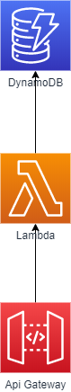
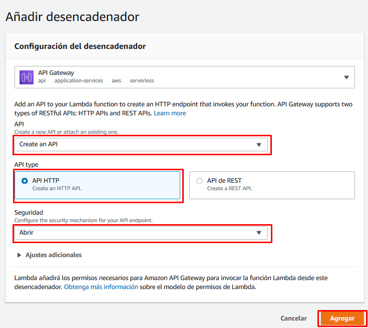
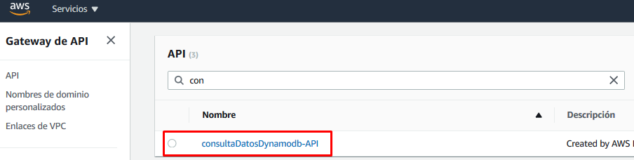
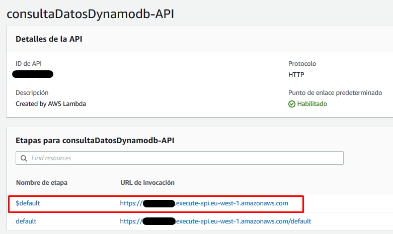
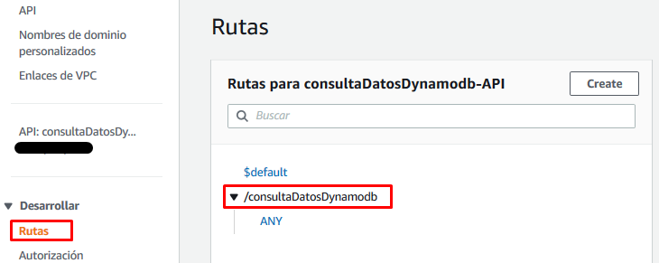
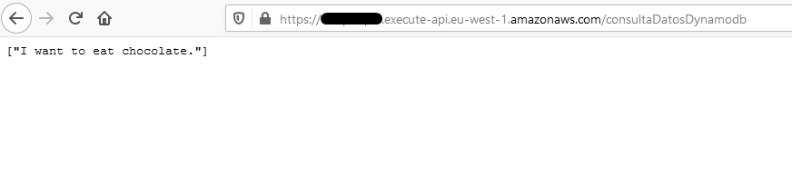

# Retrieve transcriptions from DB

En este apartado crearemos la *lambda* encargada de consultar las transcripciones añadidas en la base de datos y la API encargada de externalizar la llamada a esta *lambda* desde fuera de *AWS*.



## Creación de la lambda

Para hacerlo, iremos a la página del servicio *AWS Lambda* y pulsaremos el botón "Crear un función".

Al crear la función, seleccionaremos la opción "Crear desde cero", daremos nombre a nuestra función, seleccionaremos Node.js 12.x cómo lenguaje de ejecución y seleccionaremos la opción de "Creación de un nuevo rol con permisos básicos de Lambda".


Una vez creada, eliminaremos el código de la función y lo reemplazaremos por el siguiente [código](./audio-translator-retrieve-transcriptions-from-dynamodb.js) que se encargará de obtener nuestras transcripciones de la tabla de *DynamoDB*. Justo debajo del editor de código, hay una opción para editar las variables de entorno. Para que nuestra lambda funcione necesitaremos crear una variable de entorno:

| Clave              | Valor                             |
| ------------------ | --------------------------------- |
| DB_TABLE_NAME      | \<nombre de la tabla de DynamoDB> |
| FIELDS_TO_RETRIEVE | MessageText                       |

Para todas las demás opciones de configuración, nos quedamos con las dadas por defecto.

A continuación, añadiremos un desencadenador para nuestra lambda. Seleccionaremos la opción de *API Gateway* y junto a la opción de crear una nueva API de tipo HTTP. Para esta demo no añadiremos seguridad a nuestra API por simplicidad.



Por último nos queda acabar de configurar el rol de ejecución de la lambda para que permita la ejecución del método Scan sobre una tabla de *DynamoDB*. Para hacerlo, iremos a la pestaña de permisos y editaremos el rol de ejecución que nos aparezca.

Una vez en el editor del rol pulsaremos en el botón "Añadir una política insertada".


En la nueva política que estamos creando añadiremos los siguientes permisos en el editor JSON y le daremos un nombre:

```json
{
    "Statement": [
        {
            "Action": [
                "dynamodb:Scan"
            ],
            "Resource": "*",
            "Effect": "Allow"
        }
    ]
}
```

Ahora ya deberíamos poder ejecutar nuestra lambda sin problemas. Para hacer la prueba podemos crear un evento de prueba con con body vacío:

```
{}
```

y veremos que nos devuelve las trascripciones hechas hasta el momento.

## Prueba a través del API Gateway

Para hacer la prueba a través del endpoint del API Gateway necesitaremos obtener la URL asociada.

Para obtener dicha URL, iremos al servicio *API Gateway* y buscaremos la API que con el mismo nombre que nuestra lambda finalizado con *"-API"*.



Una vez allí, nos quedaremos con la URL de nuestra API.



A continuación, consultaremos el endpoint asociado (debería tener el mismo nombre que nuestra lambda):



Ahora que ya conocemos la URL del APIGateway asociada a nuestra lambda, ya podemos hacer la prueba:



Podemos añadir un nuevo audio en nuestro repositorio S3 inicial y ver cómo aparece el nuevo registro.

## Monitorización

Podéis validar que la lambda se está ejecutando cada vez que subáis un audio en el repositorio S3 inicial revisando la pestaña de monitorización. Incluso podéis ver los logs de la ejecución pulsando en "Ver los registros de CloudWatch". Tened en cuenta que si la lambda no se ha llegado a ejecutar nunca, no se va a encontrar ningún log.


---

Capítulo anterior: [Guardado de las transcripciones consumidas de SNS](../03-store-transcription-from-sns/guide.md)

Capítulo siguiente: [Limpieza de los recursos creados](../clean-up.md)
