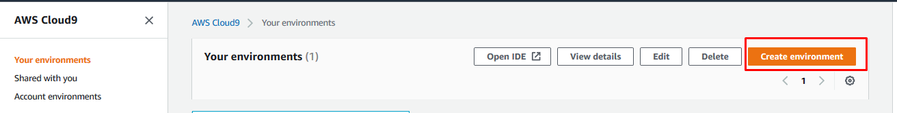
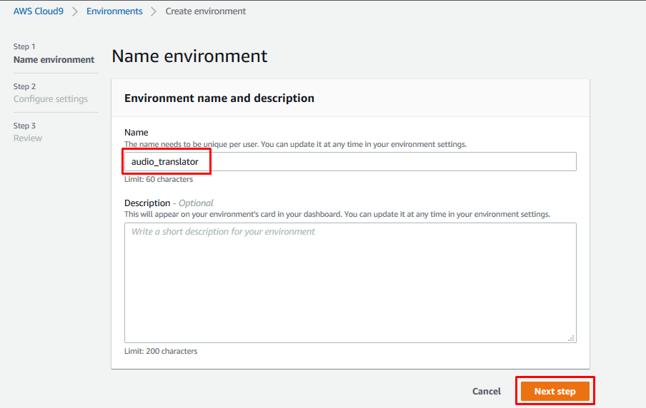
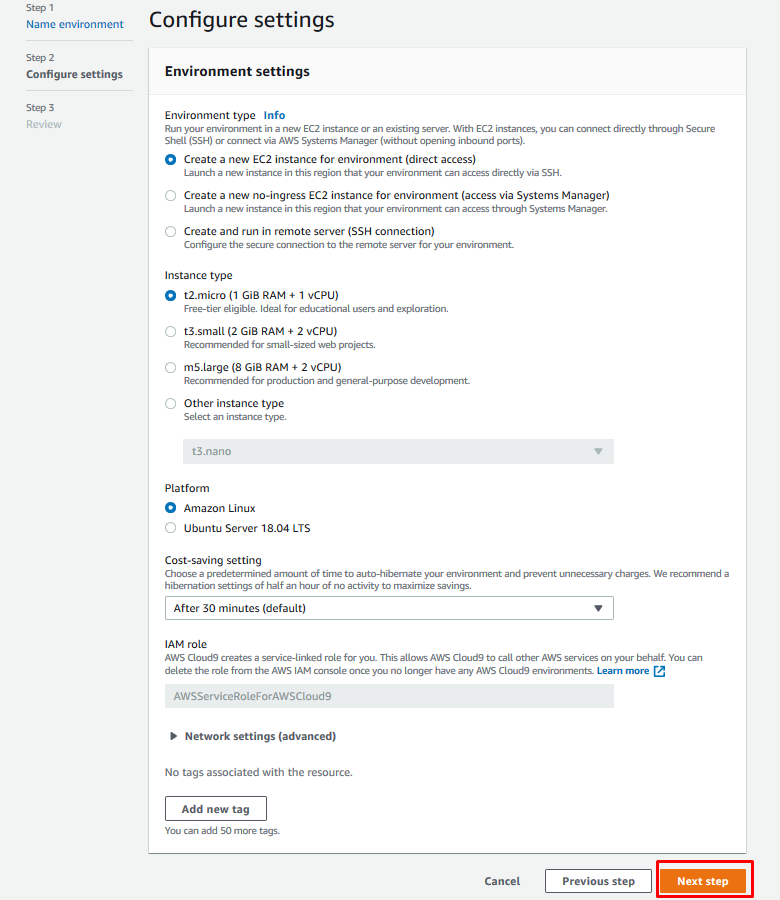
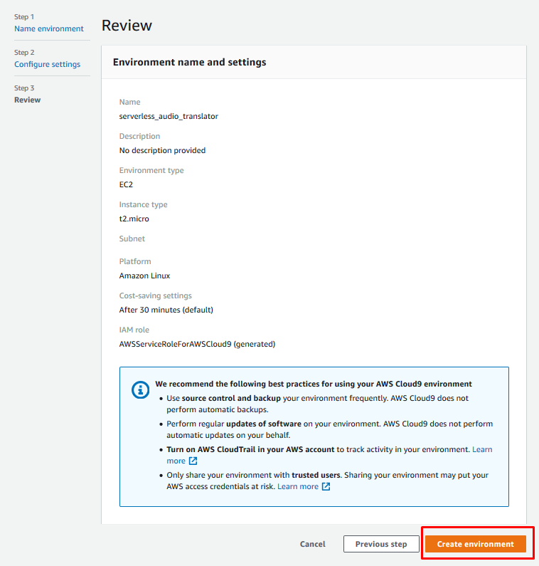

# Automatic deployment (with SAM)

Para poder ejecutar el deploy automático de nuestro aplicación serverless mediante SAM deberemos preparar nuestro entorno. Para hacerlo más simple y visual, haremos uso del IDE AWS Cloud9.

## Creación entorno Cloud9 con AWS CLI configurado

Para crear una instancia de Cloud9, iremos la consola de AWS, navegaremos al servicio de Cloud9 y crearemos un nuevo entorno de trabajo:



En el paso 1 le daremos un nombre a nuestro nuevo entorno de trabajo.



En el paso 2 podemos mantener los valores por defecto. Estos valores entran dentro de la capa gratuita de AWS.



Y finalmente en el paso 3 revisamos que los valores son los que hemos configurado.



El proceso de creación del entorno puede tardar varios minutos.

Una vez dentro, ejecutaremos el siguiente comando para validar que nuestro usuario de AWS permite ejecutar acciones programáticamente.

```
aws sts get-caller-identity
```

Si ha funcionado correctamente deberíamos ver nuestro UserId, Accound y Arn. 

En caso de no funcionar, deberemos pedir al administrador de la cuenta que nos de permisos para acceder a nuestros recursos programáticamente mediante la creación de una clave de acceso en IAM y ejecutar el siguiente comando para configurar nuestra clave de acceso en el CLI de AWS.

```
aws configure
```

## Instalación de SAM

Primero deberemos hacer update del gestor de paquetes *YUM* e instalar *Jq*. *Jq* es un  procesador de JSON para los comandos de consola.
```
sudo yum update -y
sudo yum install jq -y
```

## Descarga del proyecto

```
git clone https://github.com/OPorta/Serverless_Audio_Translator.git
cd Serverless_Audio_Translator
git pull
```

## Ejecución de scripts de deploy automático

Antes de ejecutar dichos scripts debemos asegurarnos que todos tienen permisos de ejecución. 

```
ls -l deploy-all-modules.sh
ls -l */deploy.sh
```

En caso de no tener permisos de ejecución, se los podemos dar con los siguientes comandos:
```
sudo su
chmod 777 deploy-all-modules.sh
chmod 777 */deploy.sh
exit
```

Ahora ya podemos hacer el deploy automático de toda nuestra aplicación ejecutando el siguiente commando en la carpeta principal del proyecto:
```
./deploy-all-modules.sh
```