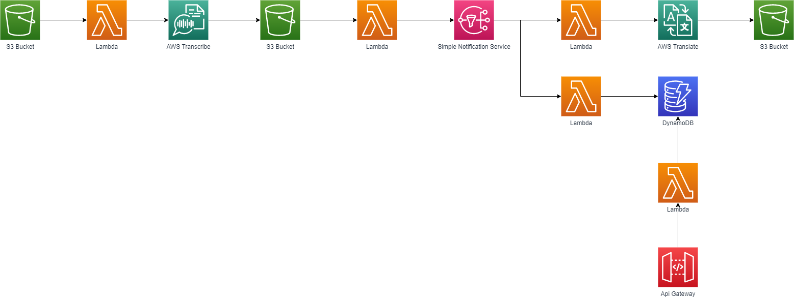

# Serverless Audio Translator

*This repository is going to be translated to english in future commits.*

El objetivo de este repositorio es montar una pequeña aplicación serverless que nos sirva cómo primera aproximación para observar distintos casos de uso de las Arquitecturas Serverless. En este ejemplo vamos a usar AWS cómo proveedor cloud y SAM cómo framework de automatización de despliegues.

*Todos los servicios de AWS que usaremos para hacer esta aplicación entran dentro de la **capa gratuita** del primer año de Amazon Web Services.*

## Tecnologías

* **AWS Lambda:** permite ejecutar código sin aprovisionar ni administrar servidores. (Ref: https://aws.amazon.com/es/lambda/)
* **Amazon S3:** servicio de almacenamiento de objetos. (Ref: https://aws.amazon.com/es/s3/)
* **Amazon Simple Notification Service (SNS):** servicio de mensajería completamente administrado para la comunicación sistema a sistema y aplicación a persona. (Ref: https://aws.amazon.com/es/sns/)
* **Amazon Transcribe:** servicio de conversión de audio a texto. (Ref: https://aws.amazon.com/es/transcribe/)
* **Amazon Translate:** servicio de traducción de idiomas. (Ref: https://aws.amazon.com/es/translate/)
* **Amazon DynamoDB:** servicio de base de datos NoSQL. (Ref: https://aws.amazon.com/es/dynamodb/)
* **Amazon Api Gateway:** servicio completamente administrado que facilita a los desarrolladores la creación, la publicación, el mantenimiento, el monitoreo y la protección de API. (Ref: https://aws.amazon.com/es/api-gateway/)
* **AWS Serverless Application Model (SAM):** framework open-source que permite la construcción de apliaciones serverless.  (Ref: https://aws.amazon.com/es/serverless/sam/)

## Descripción de la aplicación

El esquema que vamos a construir va a ser el siguiente. Cómo observaréis, los distintos bloques de código que encontraremos en nuestras lambdas se ejecutaran a partir de eventos lanzados por los repositorios S3, el servicio SNS y el API Gateway.

Hay varios flujos en esta aplicación, el primero que procesará un fichero de audio subido en un repositorio y el segundo va a consultar datos asociados a dicho fichero. A continuación los explicaremos con más detalle.

### Flujo de procesado de audio

* El flujo inicia en nuestro repositorio de objetos *S3*. 

* Cuándo un audio es subido a dicho repositorio, se ejecuta una función lambda que transcribe dicho audio mediante *AWS Transcribe* y lo deposita en otro repositorio *S3*.

* Cuándo una transcripción es subida a este segundo repositorio, se obtiene únicamente el texto completo de la transcripción y se publica en nuestro servicio de mensajería *Simple Notification Service*. Esto nos permitirá añadir varios consumidores con funcionalidades distintas que traten dicho texto.

* Cuándo el primer consumidor detecta que hay un mensaje nuevo, lo traduce mediante *AWS Translate* y deja la traducción en un nuevo repositorio *S3*.

* Cuándo el segundo consumidor detecta que hay un mensaje nuevo, guarda dicho mensaje en una base de datos *DynamoDB*.

### Flujo de consulta

Cuándo realizemos una llamada a nuestra API, se ejecutará una lambda que consultará la base de datos y nos devolverá las transcripciones hechas hasta el momento.

## Manual paso a paso

El manual se ha dividido en 5 apartados, cada uno asociado una lambda distinta.

1. [Transcripción de audio](./01-transcribe-audio-and-send-transcription-to-sns/send-audio-to-transcribe/guide.md)
2. [Publicación de las transcripciones a SNS](./01-transcribe-audio-and-send-transcription-to-sns/send-transcription-to-sns/guide.md)
3. [Traducción de transcripciones consumidas de SNS](./02-translate-transcription-from-sns/guide.md)
4. [Guardado de las transcripciones consumidas de SNS](./03-store-transcription-from-sns/guide.md)
5. [Consulta de las transcripciones](./04-retrieve-transcriptions-from-dynamodb/guide.md)

## Despliegue automático

Podéis encontrar los detalles en este [documento](./AutomaticDeployment.md).